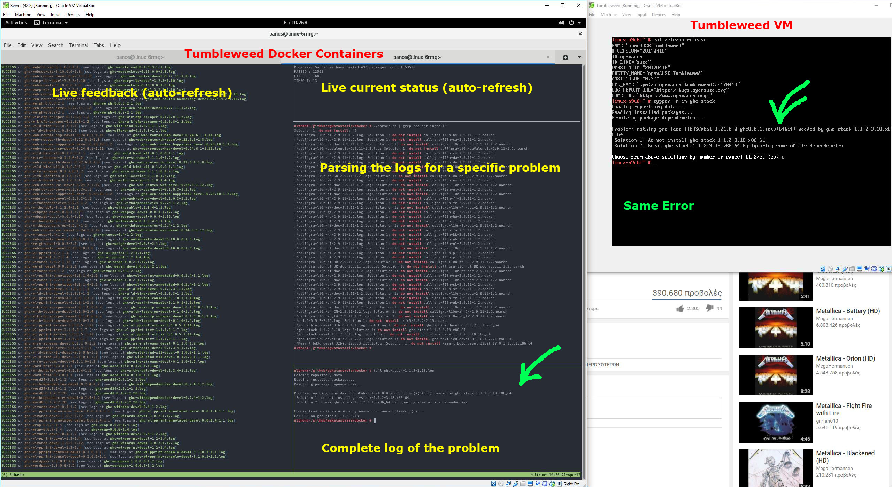

egkatastasis
############

openSUSE Tumbleweed next-gen installation testing

Utilizing the power and the speed of containers, the system spawns as many containers as many packages are existing
in Tumbleweed and tries to install them. The testing scenario is that each package should be able to be installed
in a clean Tumbleweed system.

So far, there are two implementations:

* systemd-nspawn
* docker

Feel free to try both of them.

The target goal is to catch installation problems for the already released packages
(if there are any) such as dependency conflicts and ugly RPM additional outputs.

In the process of building this, my personal goal is to learn about containers
and their possibilities.
